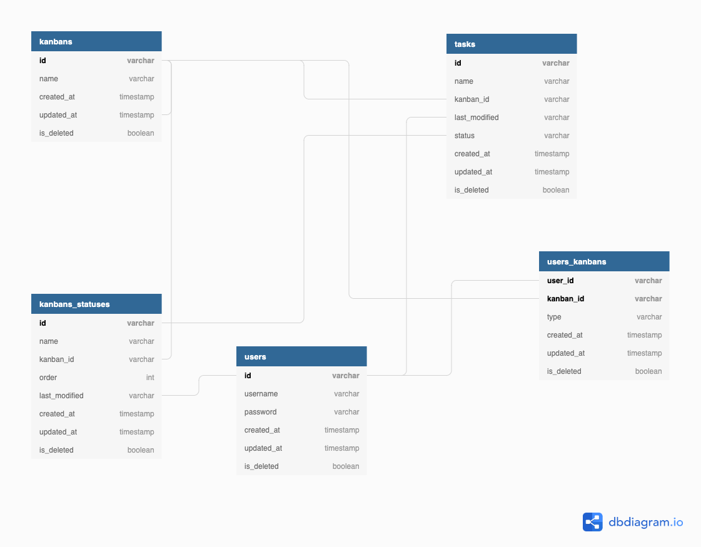
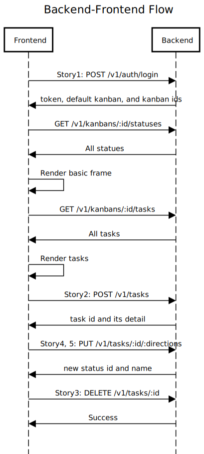

# Kanban board

[](https://circleci.com/gh/freedomsean/kanban)
[](https://codecov.io/gh/freedomsean/kanban/)


This is a Kanban board example which is developed by NodeJS and Typescript.

## How to Start

1. Setup `database` and `fluentd` by `docker-compose up -d`.
2. Add `.env` file into project directory. and follow [Env Setting](#set-env-file) to add variables.
3. Install `NodeJS`, if you do not have.
4. Run `yarn install`, if you do not have yarn, you should run `npm install -g yarn` first.
5. Run `npm run sync` to synchronize database schema.
6. Run `npm run test`, to run all testings. Please make sure your database is totally clean. Otherwise, it may have some conflict.
7. Run `npm run seed:up`, if you want to set some default data into your database.
8. Run `npm run start`, you will start HTTP Server.
9. Open `localhost:port/docs`. You will see the api document.
10. After you execute `npm run seed:up`, you can login by 

```
username: UStesting
password: UStesting
```
9. Run `npm run seed:down`, if you want to remove these testing data generated by seed.

## Design

### Database Design



### Backend-Frontend Flow Design




## Development

### Other component

- Postgres
- Fluentd

You can reference the config in `fluentd/fluent.conf`, if you need to setup in the virtual machine.

Please make sure your `.env` match what do you set in the `fluent.conf`.

### Pre-requirement

- install `nodejs` dependency

```
npm i -g yarn
yarn install
```

- install `docker` and `docker-compose`

### Set Env File

touch `.env` in your project directory and make sure you have the following environment variables.

```
# node
NODE_ENV=                   # NODE_ENV can be dev or production
HTTP_SERVER_PORT=           # HTTP server hosting port             

# database
DB_DIALECT=                 # Database type
DB_HOST=
DB_PORT=
DB_USER=
DB_PASSWORD=
DB_USED_DATABASE=
DB_POOL_MAX_CONNECTION=     # Database connection pool size
DB_SYNC=                    # Always be false when your NODE_ENV is production. If you want to change schema in the production, please find DBA or do it manually.

# jwt
JWT_SECRET=
SALT_ROUNDS=                # NodeJS default is 10
JWT_EXPIRES_IN=             # Could be something like 7d

# fluentd
FLUENTD_HOST=
FLUENTD_PORT=
FLUENTD_TIMEOUT=
FLUENTD_SHARED_KEY=         # This should be same with your config of fluentd which is defined in fluentd/fluent.conf
FLUENTD_TAG=
```


### Testing

Before you run test, please make sure you finish to setup full environment and have `.env`.

You can run `docker-compose up -d` to setup all in your local machine.

Finally, you can execute.

```
npm run test
```


### Other script

- Build typescript: `npm run build`
- Lint and fix: `npm run lint`
- Sync database schema: `npm run sync`
- Add some testing data into database: `npm run seed:up`
- Remove some testing data into database: `npm run seed:down`
- Run testings: `npm run test`. Please make sure your database is clean, before you execute this command.

## API document

- Swagger yml: `docs/api.yml`